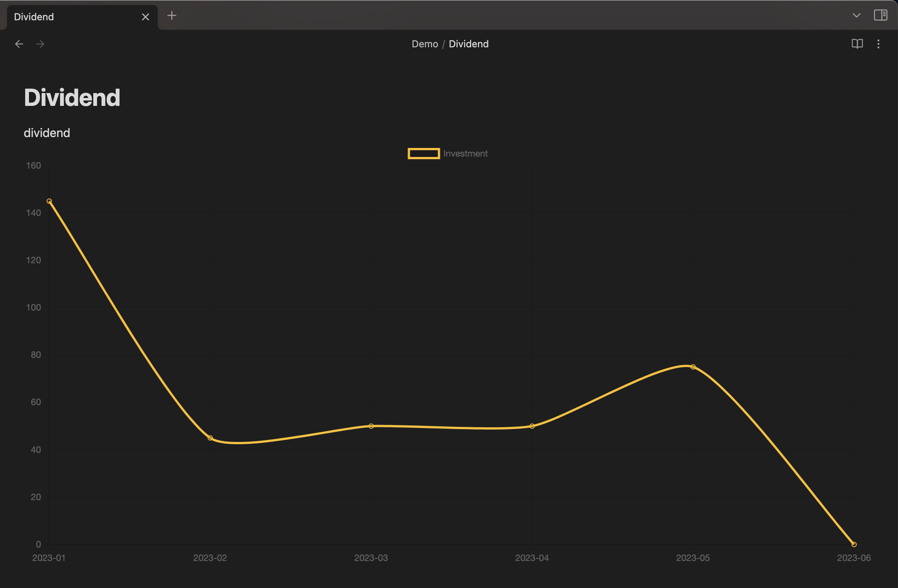
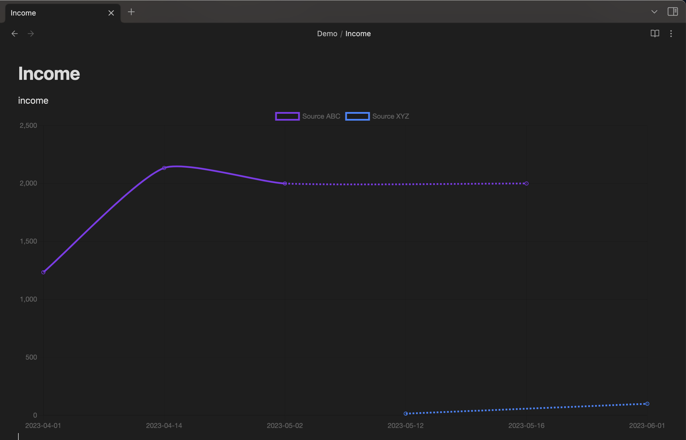
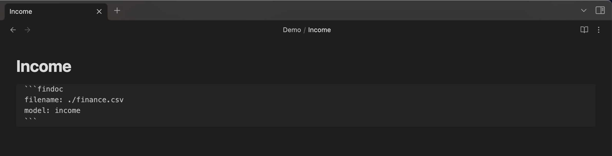
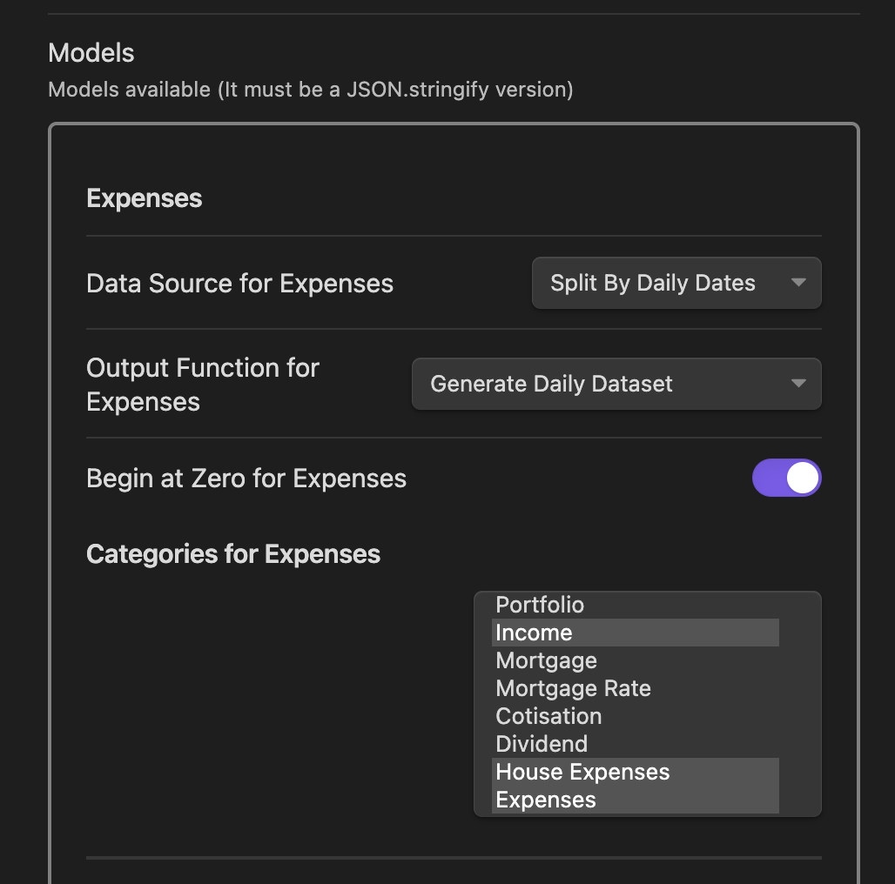
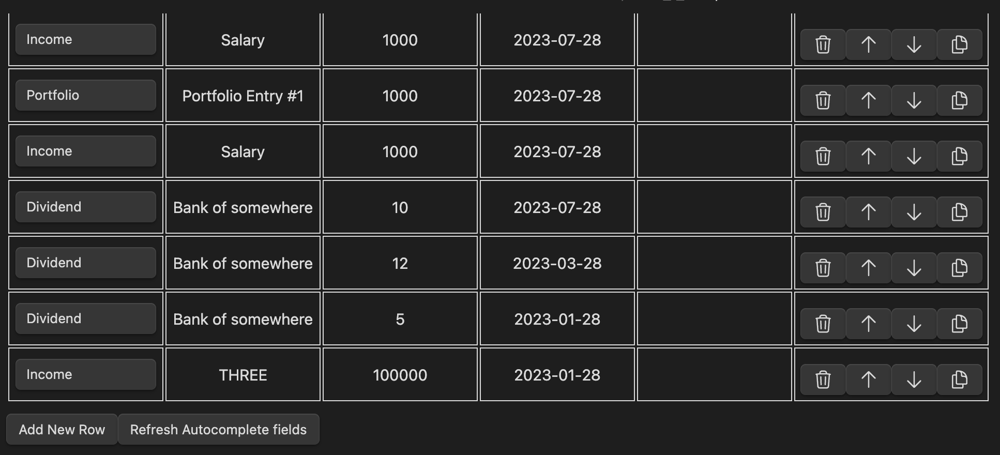
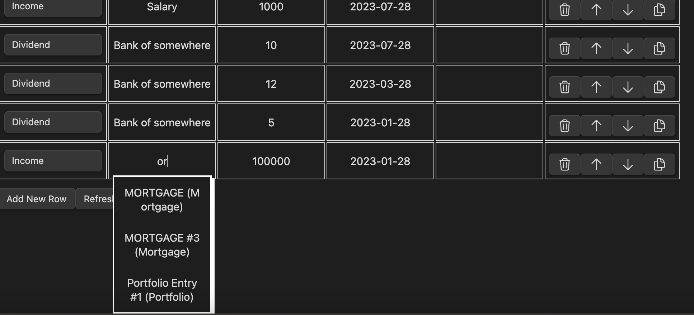

<div align="center">


<h2>Yet Another Tool - Fin Doc</h2>

<p>Obsidian.md plugin to read and edit a CSV file, then use it as a data source to generate charts.</p>
<p>I invite you to create PR and Issues with ideas, improvements and etc.</p>

<p align="center">
  <a href="https://github.com/yet-another-tool/obsidian-findoc/issues">Report Bug</a>
  ·
  <a href="https://github.com/yet-another-tool/obsidian-findoc/issues">Request Feature</a>
</p>
</div>

---

## About

-   Open and Edit CSV Files in Obsidian
-   Generate Charts using the CSV File directly in Obsidian and a Custom Code Block
-   Configurable using Few Settings
-   Support Desktop and Mobile (tested on Windows, MacOS and Iphone)
-   Using [Chart.js](https://www.chartjs.org)
-   Plugin for [Obsidian.md](https://obsidian.md)

---

## Installation and Usage

**V0.6.0 BREAKING CHANGES**: Configurations have been updated massively to reflect all the changes. Please follow the documentation to update the default configuration: https://studiowebux.github.io/obsidian-plugins-docs/docs/findoc/defaultConfigurations/

Documentation is available here: https://studiowebux.github.io/obsidian-plugins-docs/docs/category/plugin-financial-doc

### Releases and Github Actions

```bash
git tag -a X.Y.Z -m "Version X.Y.Z"
git push origin tags/X.Y.Z
```

---

## Screenshots








---

## Changelog

### TODO

-   [-] Copy paste is broken while editing a CSV File (not able to reproduce)
-   [] Improve the setting tab (edit, add and remove models)
-   [] Add more functions to process and analyze the data
-   [] Add more Chart types, currently only line chart is supported
-   [] Add reports using pie chart or something like that
-   [POC] Add reports in table view

### V0.6.0 - Beta - 2023-10-28

New documentation Link: https://studiowebux.github.io/obsidian-plugins-docs/docs/category/plugin-financial-doc

- Changed naming:
  - Types => Categories
  - Id => Subcategory
  - Types => View (to use : chart or report in the snippet)
- Moved documentation to an external page with screenshot and examples and etc.
- Added toggle button to show/hide extra information about a chart
- Added new reports (difference and sum, this is still under heavy development, I still want to improve that part, but I need to merge.)
- Improved settings, added new options (see documentation for all information about it)
- Added Chart type and configuration (not locked to money anymore)
- CSV Header should be change to Category and Subcategory (see documentation)
- **BREAKING CHANGES:** the default.json has been updated massively to reflect all the changes. (Documentation with updated default configuration: https://studiowebux.github.io/obsidian-plugins-docs/docs/findoc/defaultConfigurations/)
- Added new methods (sum, difference, splitBy, code cleanup and renaming to match new implementation) still a lot of work to do in that file but I want to merge the current state.
- Improved Error handling for few cases. (still working on that one as well)
- Updated CSS a little bit...
- Added test data and two file with a bunch of tests and commands, my goal is to improve the model and make it easy to build new models.

See [CHANGELOG](./CHANGELOG)

---

## Contributing

1. Create a Feature Branch
2. Commit your changes
3. Push your changes
4. Create a PR

<details>
<summary>Working with your local branch</summary>

**Branch Checkout:**

```bash
git checkout -b <feature|fix|release|chore|hotfix>/prefix-name
```

> Your branch name must starts with [feature|fix|release|chore|hotfix] and use a / before the name;
> Use hyphens as separator;
> The prefix correspond to your Kanban tool id (e.g. abc-123)

**Keep your branch synced:**

```bash
git fetch origin
git rebase origin/master
```

**Commit your changes:**

```bash
git add .
git commit -m "<feat|ci|test|docs|build|chore|style|refactor|perf|BREAKING CHANGE>: commit message"
```

> Follow this convention commitlint for your commit message structure

**Push your changes:**

```bash
git push origin <feature|fix|release|chore|hotfix>/prefix-name
```

**Examples:**

```bash
git checkout -b release/v1.15.5
git checkout -b feature/abc-123-something-awesome
git checkout -b hotfix/abc-432-something-bad-to-fix
```

```bash
git commit -m "docs: added awesome documentation"
git commit -m "feat: added new feature"
git commit -m "test: added tests"
```

</details>

### Local Development

```bash
npm install
npm run build
```

## License

Distributed under the MIT License. See LICENSE for more information.

## Contact

-   Tommy Gingras @ tommy@studiowebux.com | Studio Webux

<div>
<b> | </b>
<a href="https://www.buymeacoffee.com/studiowebux" target="_blank"
      ></a>
<b> | </b>
<a href="https://webuxlab.com" target="_blank"
      > Webux Lab</a>
<b> | </b>
</div>
