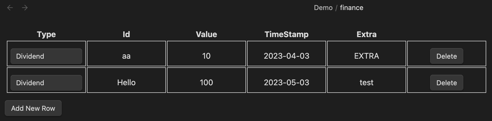
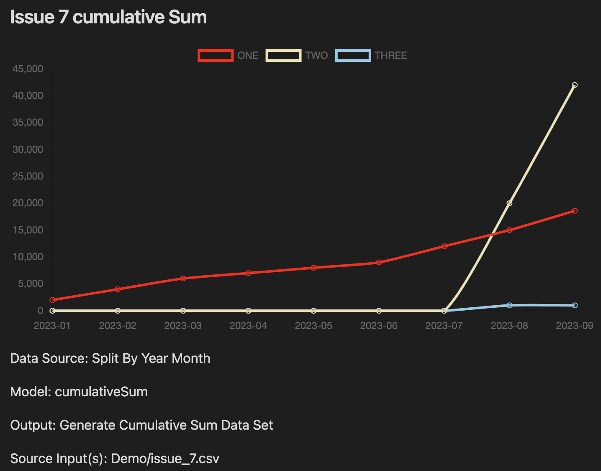
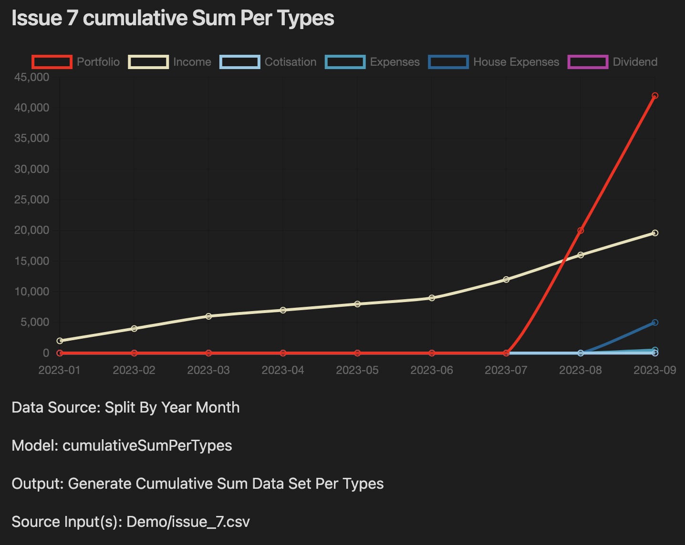
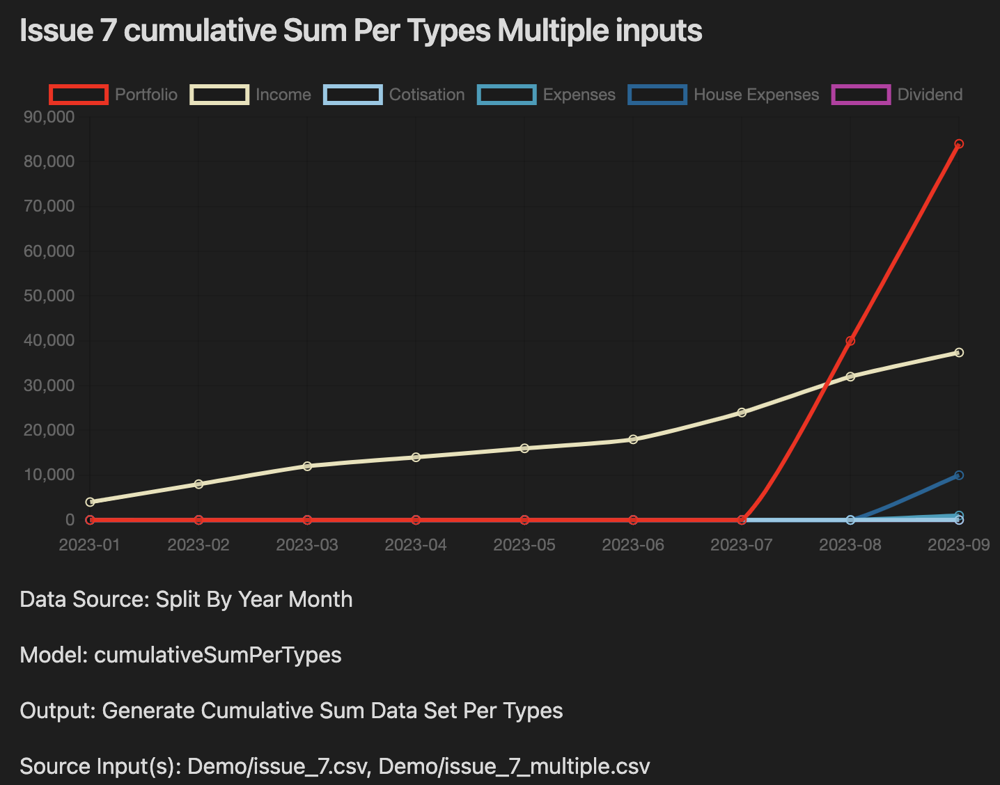
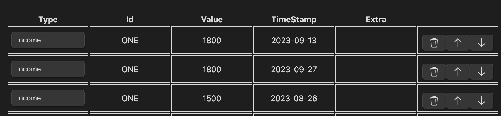

<div align="center">


<h2>Yet Another Tool - Fin Doc</h2>

<p>Obsidian.md plugin to read and edit a CSV file, then use it as a data source to generate charts.</p>
<p>I invite you to create PR and Issues with ideas, improvements and etc.</p>

<p align="center">
  <a href="https://github.com/yet-another-tool/obsidian-findoc/issues">Report Bug</a>
  ·
  <a href="https://github.com/yet-another-tool/obsidian-findoc/issues">Request Feature</a>
</p>
</div>

---

<details open="open">
  <summary>Table of Contents</summary>
  <ol>
    <li>
      <a href="#about">About</a>
    </li>
    <li><a href="#installation">Installation</a></li>
    <li>
      <a href="#usage">Usage</a>
    </li>
    <li><a href="#changelog">Changelog</a></li>
    <li><a href="#screenshots">Screenshots</a></li>
    <li><a href="#contributing">Contributing</a></li>
    <li><a href="#license">License</a></li>
    <li><a href="#contact">Contact</a></li>
  </ol>
</details>
---

## About

-   Open and Edit CSV Files in Obsidian
-   Generate Charts using the CSV File directly in Obsidian and a Custom Code Block
-   Configurable using Few Settings
-   Support Desktop and Mobile (tested on Windows, MacOS and Iphone)
-   Using [Chart.js](https://www.chartjs.org)
-   Plugin for [Obsidian.md](https://obsidian.md)

---

## Installation

It is now in Beta, you can download a release and install it in your local obsidian plugin.

> As soon as the CSV aspect is stable, I will open a PR in the Obsidian Plugin registry.

```bash
npm install
npm run build
```

Move the `main.js` and `manifest.json` to your plugins directory in a directory named `findoc`.

### Releases and Github Actions

```bash
git tag -a X.Y.Z -m "Version X.Y.Z"
git push origin tags/X.Y.Z
```

---

## Usage

### Models

-   **expenses**
-   **expensesMonthly**
-   **portfolio**
-   **incomeYearly**
-   **income**
-   **all**
-   **mortgage**
-   **mortgageRate**
-   **dividend**
-   **cumulativeSum**
-   **cumulativeSumPerTypes**

Create a PR to create new one.  
You can edit those directly in the setting tab.

### Code Block

You can define this code block directly in your notes.

<pre>
```findoc
filename: finance.csv, finance_2.csv
model: portfolio
type: chart OR report
date: YYYY-MM-DD (Only used when type is set to report)
title: Chart Title
```
</pre>

> When you do not specify the `type`, it will generate a chart by default.
> When you do specify the `type`, you can set the `date` to gather the data for a specific month. (This feature is still a proof of concept)

**Information**

-   **_Filename_**: it can be a single file, or multiple. You must use a comma `,` to split each file, the data will be loaded in the same order.
-   **_Title_**: Optional, by default it uses the `model` name.

> See above for all available models.

Once the code block is defined, the hook will try to generate a chart by reading the csv file.

### Types (For the code block section only)

-   **chart**: Generate a chartJS
-   **report**: Generate simple HTML Output (Proof of concept)

### The CSV File

The CSV Header is :

```csv
Type,Id,Value,TimeStamp,Extra
```

Where **Type** is one of:

-   **Portfolio**
-   **Income**
-   **Mortgage**
-   **Mortgage Rate**
-   **Cotisation**
-   **Dividend**
-   **House Expenses**
-   **Expenses**

The **Id** is preferably _Unique for a group_, otherwise you will have weird behaviour and wrong grouping.

The **Value** must be a **Number**

The **Timestamp** is only a _Date_ using this format: `'YYYY-MM-DD'`

The **Extra** is not used.

**Can I use any software and export a CSV File**: Yes.

**What is a category?**: This is the _Id_, for example, you can have an `House Expenses` (<-Type) about the `Tax` (<-Category)

---

## Screenshots





---

## Changelog

### TODO

-   [-] Copy paste is broken while editing a CSV File (not able to reproduce)
-   [] Improve the setting tab (edit, add and remove models)
-   [] Add more functions to process and analyze the data
-   [] Write better documentation
-   [] Add more Chart types, currently only line chart is supported
-   [] Add reports using pie chart or something like that
-   [POC] Add reports in table view
-   [] configurable autocomplete (toggle on/off)

### V0.5.3 - Beta POC - 2023-09-27

-   Optional Title for Charts
-   Load multiple CSV Files
-   Added icons
-   Reorder rows
-   New model to chart cumulative sum (per types and/or id)

```findoc
filename: finance.csv, finance_2.csv
model: cumulativeSum
type: chart
title: Chart Title
```

```findoc
filename: finance.csv
model: cumulativeSumPerTypes
type: chart
title: Chart Title
```






See [CHANGELOG](./CHANGELOG)

---

## Contributing

1. Create a Feature Branch
2. Commit your changes
3. Push your changes
4. Create a PR

<details>
<summary>Working with your local branch</summary>

**Branch Checkout:**

```bash
git checkout -b <feature|fix|release|chore|hotfix>/prefix-name
```

> Your branch name must starts with [feature|fix|release|chore|hotfix] and use a / before the name;
> Use hyphens as separator;
> The prefix correspond to your Kanban tool id (e.g. abc-123)

**Keep your branch synced:**

```bash
git fetch origin
git rebase origin/master
```

**Commit your changes:**

```bash
git add .
git commit -m "<feat|ci|test|docs|build|chore|style|refactor|perf|BREAKING CHANGE>: commit message"
```

> Follow this convention commitlint for your commit message structure

**Push your changes:**

```bash
git push origin <feature|fix|release|chore|hotfix>/prefix-name
```

**Examples:**

```bash
git checkout -b release/v1.15.5
git checkout -b feature/abc-123-something-awesome
git checkout -b hotfix/abc-432-something-bad-to-fix
```

```bash
git commit -m "docs: added awesome documentation"
git commit -m "feat: added new feature"
git commit -m "test: added tests"
```

</details>

### Local Development

```bash
npm install
npm run build
```

## License

Distributed under the MIT License. See LICENSE for more information.

## Contact

-   Tommy Gingras @ tommy@studiowebux.com | Studio Webux

<div>
<b> | </b>
<a href="https://www.buymeacoffee.com/studiowebux" target="_blank"
      ></a>
<b> | </b>
<a href="https://webuxlab.com" target="_blank"
      > Webux Lab</a>
<b> | </b>
</div>
